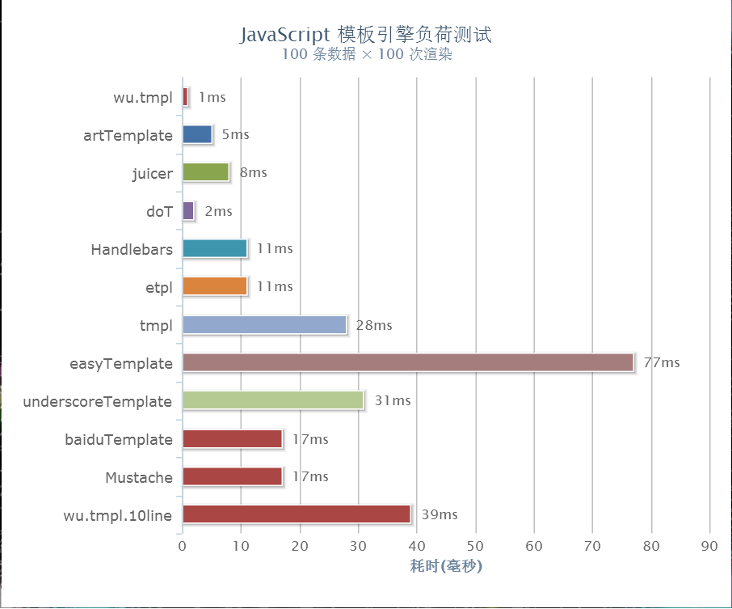

# wutpl.js
极简高性能模板引擎  


------------------------------------------
## 性能测试
[测试](https://wusfen.github.io/wutpl/test/template_test.html)  
  


## 使用方法
```html
<!DOCTYPE html>
<html>

<body>
  
  <!-- 1: 编写模板 -->
  <ul id="tpl">
    {{each list item index}}
    <li>
      {{item.name}}
      {{if item.age>18}} 18+ {{/if}}
    </li>
    {{/each}}
  </ul>

  <!-- 2: 引入wutpl。支持es6, requireJS -->
  <script src="../wutpl.js"></script>

  <!-- 3: 编译与渲染 -->
  <script>
    wutpl(tpl, {
      list: [
        { id: 1, name: 'Tom', age: 21 },
        { id: 2, name: 'Lily', age: 17 },
        { id: 3, name: 'Mary', age: 18 }
      ]
    })
  </script>

</body>

</html>
```


## API
```javascript
var render = wutpl(tpl)
var html = wutpl(tpl, data)
```
* tpl {String|Node}: 字符串模板或者节点。节点使用innerHTML作为模板
* data {Object}: 模板数据
* render(data) {Function}: 渲染函数。若为节点模板会自动更新
* html: {String}: 渲染后的html字符串


------------------------------------------
## 模板语法

* if, else, else if
```javascript
{{if 条件1}}
 ...
{{else if 条件2}}
 ...
{{else}}
 ...
{{/if}}
```
* each
```javascript
{{for array item index}}
 ...
{{/for}}
```
```javascript
{{for object value key}}
 ...
{{/for}}
```
* {{ expression }}
```javascript
{{ 1+1 }}
```
```javascript
{{ bool? 'yes': 'no' }}
```


## 实例

* [hello world](https://wusfen.github.io/wutpl/examples/helloWorld.html) | [源码](examples/helloWorld.html)
* [时钟](https://wusfen.github.io/wutpl/examples/time.html) | [源码](examples/time.html)
* [动画](https://wusfen.github.io/wutpl/examples/animate.html) | [源码](examples/animate.html)
* [ajax](https://wusfen.github.io/wutpl/examples/ajax.html) | [源码](examples/ajax.html)
* [list](https://wusfen.github.io/wutpl/examples/list.html) | [源码](examples/list.html)
